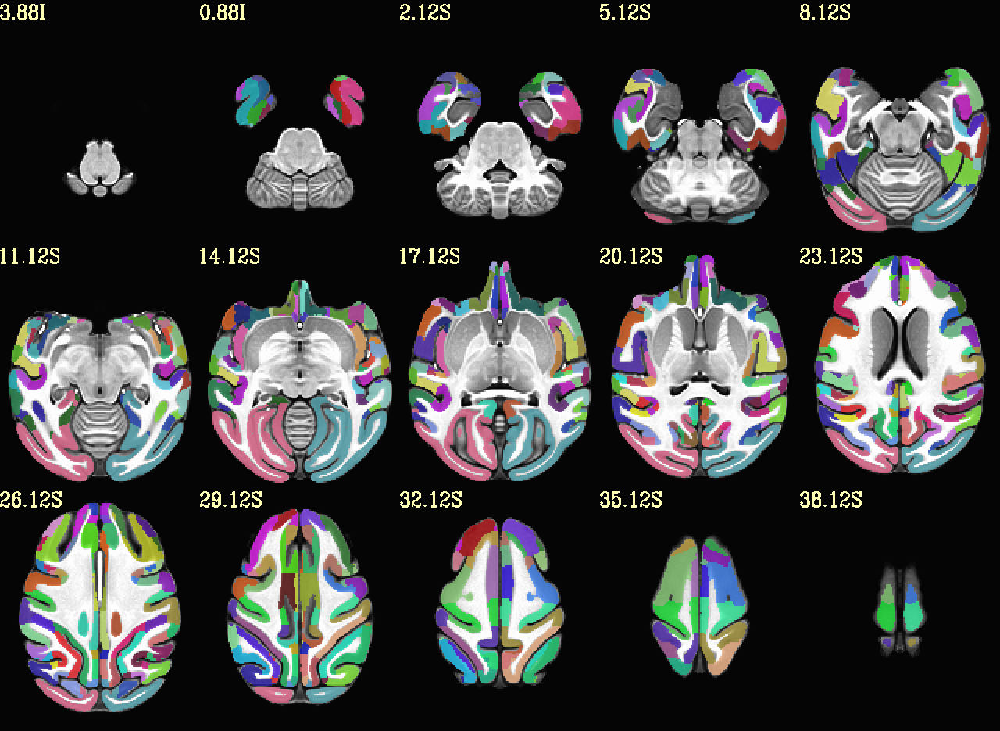

# **chauffeur.tcsh**

## Description

This script uses `chauffeur_afni` (from the AFNI suite) to visualize regions of interest (ROIs) from atlases — such as the CHARM atlas — in a chosen template space (e.g., NMT).

The generated output is a montage of labeled brain slices using customized display options.

## Customization

You can choose:
- the underlay (template),
- the overlay (atlas),
- the color bar (e.g., `ROI_i256`).

Make sure the atlas and template are in the same spatial resolution and orientation.

## Installation

### Required software

- [AFNI](https://afni.nimh.nih.gov/pub/dist/doc/htmldoc/background_install/main_toc.html) – Required for `chauffeur_afni`

## Usage

### Requirements

- The desired template (underlay) and atlas (overlay) must be located in the same directory as the script.
- All file paths must be correctly specified.

### Running the script

Execute with:

```bash
tcsh chauffeur.tcsh
```

## Example

This is the example output from this code (here: axial slice): 



## Author

* Tabea Bruening
* German Primate Center/DAG

